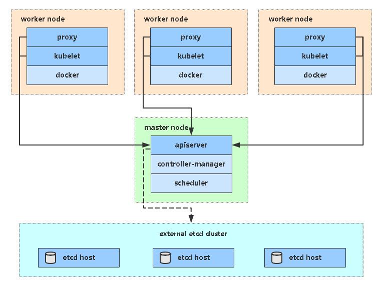

# Kubernetes v1.20 企业级高可用集群自动部署（离线版）
>### 注：确保所有节点系统时间一致
>### 操作系统要求：CentOS7.x_x64

### 1、找一台服务器安装Ansible
```
# yum install epel-release -y
# yum install ansible -y
```
### 2、下载所需文件

下载Ansible部署文件：

```
# git clone https://github.com/zhengdazhi/ansible-install-k8s
# cd ansible-install-k8s
```

下载准备好软件包（包含所有涉及文件和镜像，比较大），解压到/root目录：

链接：https://pan.baidu.com/s/1y7H00Z689cOW-TGiP4_4kg 
提取码：mo08

```
# tar zxf binary_pkg.tar.gz
```
### 3、修改Ansible文件

修改hosts文件，根据规划修改对应IP和名称。

```
# vi hosts
...
```
修改group_vars/all.yml文件，修改软件包目录和证书可信任IP。

```
# vim group_vars/all.yml
software_dir: '/root/binary_pkg'
...
cert_hosts:
  k8s:
  etcd:
```
## 4、一键部署
### 4.1 架构图
单Master架构


多Master架构

### 4.2 部署命令
单Master版：
```
# ansible-playbook -i hosts single-master-deploy.yml -uroot -k
```
多Master版：
```
# ansible-playbook -i hosts multi-master-deploy.yml -uroot -k
```

## 5、查看集群节点
```
# kubectl get node
NAME          STATUS   ROLES    AGE   VERSION
k8s-master    Ready    <none>   9h    v1.20.4
k8s-node1     Ready    <none>   9h    v1.20.4
k8s-node2     Ready    <none>   9h    v1.20.4
```

## 6、其他
### 6.1 部署控制
如果安装某个阶段失败，可针对性测试.

例如：只运行部署插件
```
# ansible-playbook -i hosts single-master-deploy.yml -uroot -k --tags addons
```

### 6.2 节点扩容
1）修改hosts，添加新节点ip
```
# vi hosts
...
[newnode]
192.168.31.75 node_name=k8s-node3
```
2）执行部署
```
# ansible-playbook -i hosts add-node.yml -uroot -k
```
### 6.3 所有HTTPS证书存放路径
部署产生的证书都会存放到目录“ansible-install-k8s-master/ssl”，一定要保存好，后面还会用到~

7、部署kuboard

kuboard管理界面最好独立k8s部署

https://kuboard.cn/install/v3/install-built-in.html#%E9%83%A8%E7%BD%B2%E8%AE%A1%E5%88%92

```
docker run -d \
  --restart=unless-stopped \
  --name=kuboard \
  -p 80:80/tcp \
  -p 10081:10081/tcp \
  -e KUBOARD_ENDPOINT="http://内网IP:80" \
  -e KUBOARD_AGENT_SERVER_TCP_PORT="10081" \
  -v /root/kuboard-data:/data \
  eipwork/kuboard:v3
  # 也可以使用镜像 swr.cn-east-2.myhuaweicloud.com/kuboard/kuboard:v3 ，可以更快地完成镜像下载。
  # 请不要使用 127.0.0.1 或者 localhost 作为内网 IP \
  # Kuboard 不需要和 K8S 在同一个网段，Kuboard Agent 甚至可以通过代理访问 Kuboard Server \
```

完成后登录，这里独立k8s部署，因此要配置kuboard连接k8s

创建连接k8s配置,使用ansible创建的/root/.kube/config 文件无法用来直接连接k8s，需要额外创建

```
[root@localhost .kube]# cat /root/.kube/config 
apiVersion: v1
clusters:
- cluster:
    certificate-authority: /opt/kubernetes/ssl/ca.pem
    server: https://10.10.1.171:6443
  name: kubernetes
contexts:
- context:
    cluster: kubernetes
    user: admin
  name: default
current-context: default
kind: Config
preferences: {}
users:
- name: admin
  user:
    client-certificate: /opt/kubernetes/ssl/admin.pem
    client-key: /opt/kubernetes/ssl/admin-key.pem
```


```
# 创建admin用户证书，admin用户是管理k8s集群的
cfssl gencert \
-ca=/opt/kubernetes/ssl/ca.pem \
-ca-key=/opt/kubernetes/ssl/ca-key.pem \
-config=ca-config.json \
-profile=kubernetes \
admin-csr.json | cfssljson -bare /opt/kubernetes/ssl/admin

# 设置一个集群
kubectl config set-cluster kubernetes \
--certificate-authority=/opt/kubernetes/ssl/ca.pem \
--embed-certs=true \
--server=https://10.10.1.170:16443 \
--kubeconfig=/opt/kubernetes/ssl/admin.kubeconfig

# 创建一个用户
kubectl config set-credentials kubernetes-admin \
--client-certificate=/opt/kubernetes/ssl/admin.pem \
--client-key=/opt/kubernetes/ssl/admin-key.pem \
--embed-certs=true \
--kubeconfig=/opt/kubernetes/ssl/admin.kubeconfig

# 设置上下文
kubectl config set-context kubernetes-admin@kubernetes \
--cluster=kubernetes \
--user=kubernetes-admin \
--kubeconfig=/opt/kubernetes/ssl/admin.kubeconfig

# 设置默认环境
kubectl config use-context kubernetes-admin@kubernetes \
--kubeconfig=/opt/kubernetes/ssl/admin.kubeconfig
```

查看/opt/kubernetes/ssl/admin.kubeconfig

```
[root@localhost .kube]# cat /opt/kubernetes/ssl/admin.kubeconfig
apiVersion: v1
clusters:
- cluster:
    certificate-authority-data: LS0tLS1CRUdJTiBDRVJUSUZJQ0FURS0tLS0tCk1JSUR2akNDQXFhZ0F3SUJBZ0lVT2NDMCtHLyt1L3NIQXhqR2s4QnlsWTNudUNZd0RRWUpLb1pJaHZjTkFRRUwKQlFBd1pURUxNQWtHQTFVRUJoTUNRMDR4RURBT0JnTlZCQWdUQjBKbGFXcHBibWN4RURBT0JnTlZCQWNUQjBKbAphV3BwYm1jeE......................WVZpdHdLVXI0dnVmTEJPTTh2d3UKOGc0ZjBkUHlrY1hWeEc3azloZVgzd1RZRXdVOGppa1krMTVFdHdLUnhVbTB2Vzc4ZnhMbkgxNzFsZ1ZwU0NpawpqbFE9Ci0tLS0tRU5EIENFUlRJRklDQVRFLS0tLS0K
    server: https://10.10.1.170:16443
  name: kubernetes
contexts:
- context:
    cluster: kubernetes
    user: kubernetes-admin
  name: kubernetes-admin@kubernetes
current-context: kubernetes-admin@kubernetes
kind: Config
preferences: {}
users:
- name: kubernetes-admin
  user:
    client-certificate-data: LS0tLS1CRUdJTiBDRVJUSUZJQ0FURS0tLS0tCk1JSUQzVENDQXNXZ0F3SUJBZ0lVWEQ1aDdYWmZGUjAzY0ZuQmhvUWFydi90R09Nd0RRWUpLb1pJaHZjTkFRRUwKQlFBd1pURUxNQWtHQTFVRUJoTUNRMDR4RURBT0JnTlZCQWdUQjBKbGFXcHBibWN4RURBT0JnTlZCQWNUQjBKbAphV3BwYm1jeE.............HI1bHdiU1FlTDF1TW42WklDbUJGaHRLUHI1VG5PTENJb01jc0JIVUtvMjhuditGcDJWdApsWGI5T1VDQWptR0laSkNMQ1BKQTRZOGx1MXFwWVQ3dGQ0ZzdJYVY3bmxPSQotLS0tLUVORCBDRVJUSUZJQ0FURS0tLS0tCg==
    client-key-data: LS0tLS1CRUdJTiBSU0EgUFJJVkFURSBLRVktLS0tLQpNSUlFcFFJQkFBS0NBUUVBc3V5SGd0WTNxTzZQYkhwcHh5eGNZd29lU0huTEFJdzBWc0FjVSsrbys0bXhIZWY5CmtZNTBXV2JuVldHVkJ0............yQ3RaVXp5MXZKRXdNOCt1dU92SEp6YkE5Z3hlWkhoR2JrOTZ4YQpNSWdoclFEWjhZaFhOdDdvL2FXTnIzTHcwWWF1YWl2d3k3R2J4MzJSSW9CZzFOWGhMNCtuSEc4PQotLS0tLUVORCBSU0EgUFJJVkFURSBLRVktLS0tLQo=
```

这里添加集群


将生产的 admin.kubeconfig 粘贴到kuboard的 kubeconfig配置中


连接后可以通过kuboard管理k8s集群

